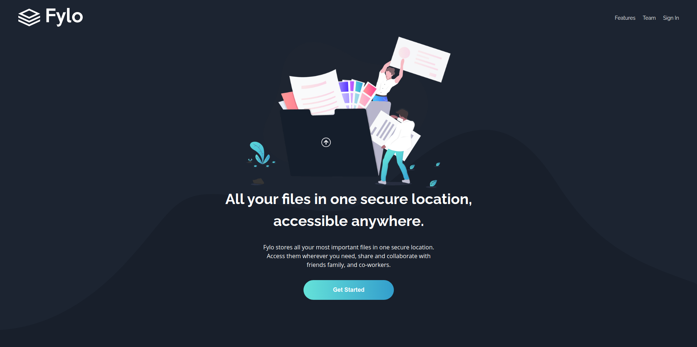
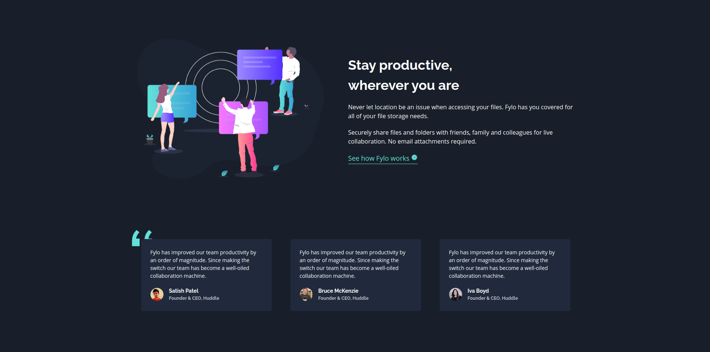
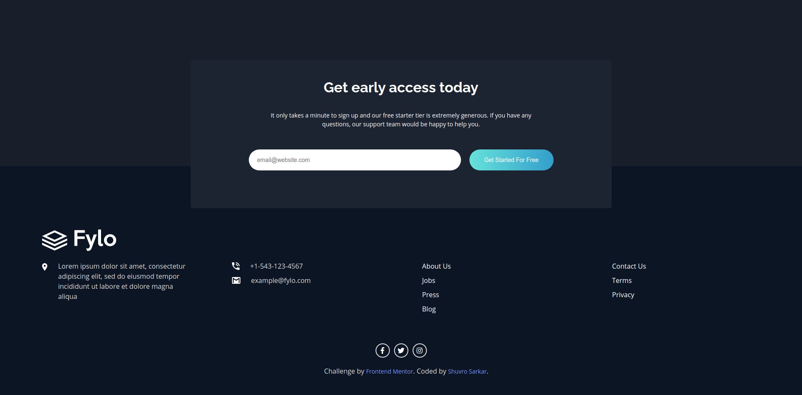

## Frontend Mentor - Fylo dark theme landing page solution 🚀

This is a solution to the [Fylo dark theme landing page challenge on Frontend Mentor](https://www.frontendmentor.io/challenges/fylo-dark-theme-landing-page-5ca5f2d21e82137ec91a50fd). Frontend Mentor challenges help you improve your coding skills by building realistic projects.

### Table of contents

- [Overview](#overview)
  - [Screenshots](#screenshots)
  - [Links](#links)
- [My process](#my-process)
  - [Built with](#built-with)
  - [Continued development](#continued-development)
  - [Useful resources](#useful-resources)
- [Author](#author)
  - **Shuvro Sarkar**
  - [Connect with me](#connect)

### Overview

#### Screenshots

### Links

- Solution URL: [View on Github](https://back-spac3.github.io/fylo-landing-page)
- Live Site URL: [Live Demo on Github Pages](https://fylo-landing-page-1.netlify.app/)

### My process

#### Built with

- Semantic HTML5 markup
- CSS custom properties (Sass)
- Flexbox
- Desktop-first workflow
- [React](https://reactjs.org/) - JS library

#### Continued development

I will participate in more [Frontend Mentor](https://frontendmentor.io) challenges and do normal design projects to boost up my design skills in future.

#### Useful resources

- [ReactJS](https://www.reactjs.org) - Frontend library
- [Sass](https://www.example.com) - Giving superpowers to css
- [React Router](https://www.example.com) - Routing in different pages inside a react app.

#### Connect with me

- Website - [Shuvro Sarkar](https://back-spac3.github.io/artist)
- Facebook - [@Shuvro Sarkar](https://www.facebook.com/shuvrosarkar111)
- Email - backspacecrew18@gmail.com
